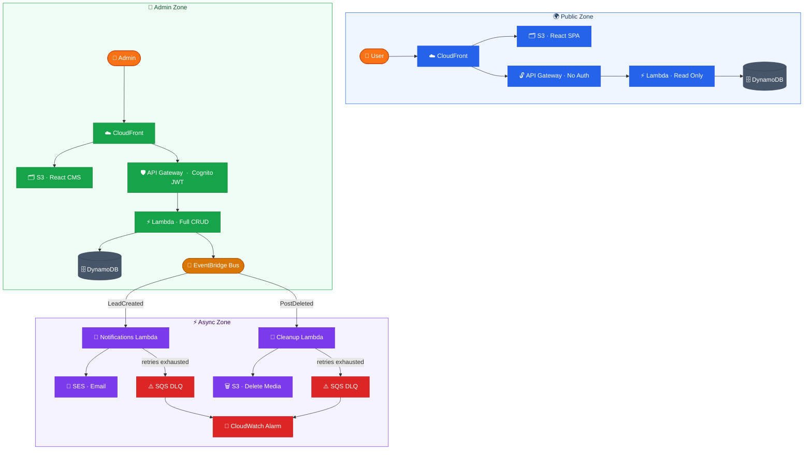
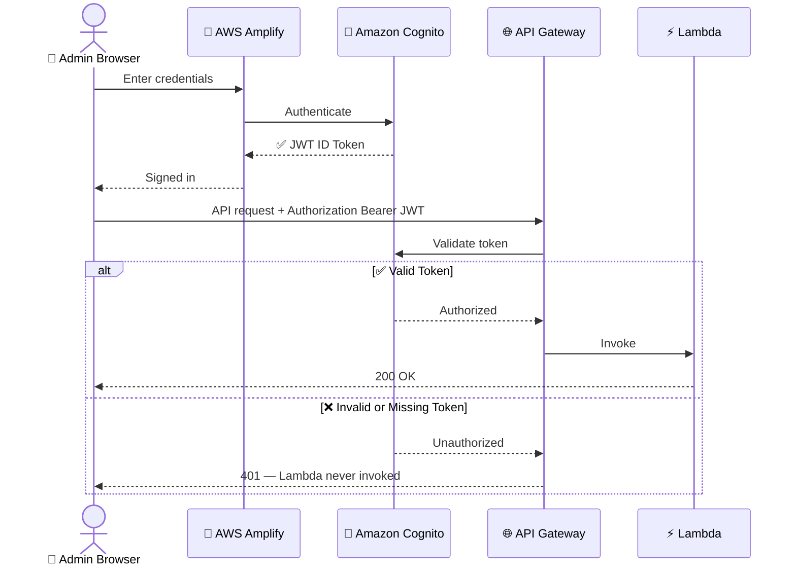
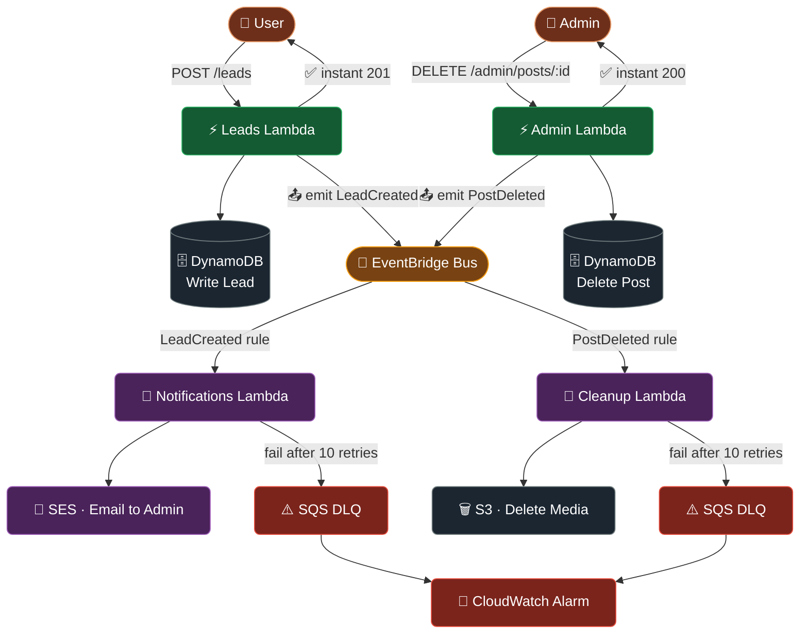
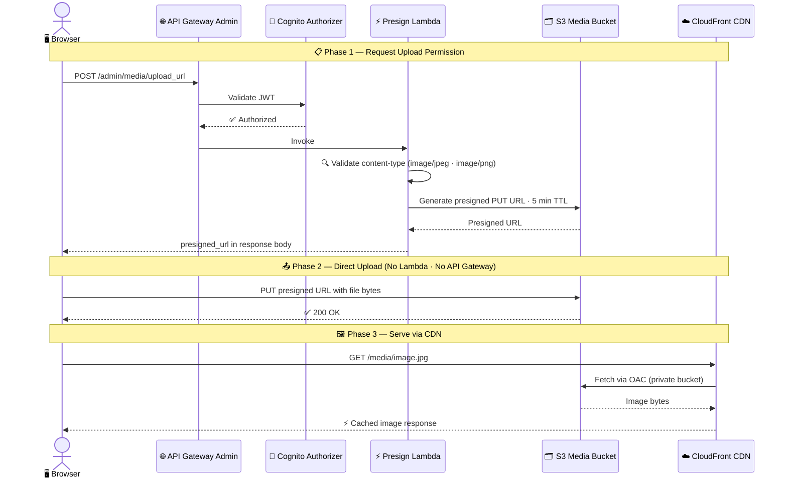
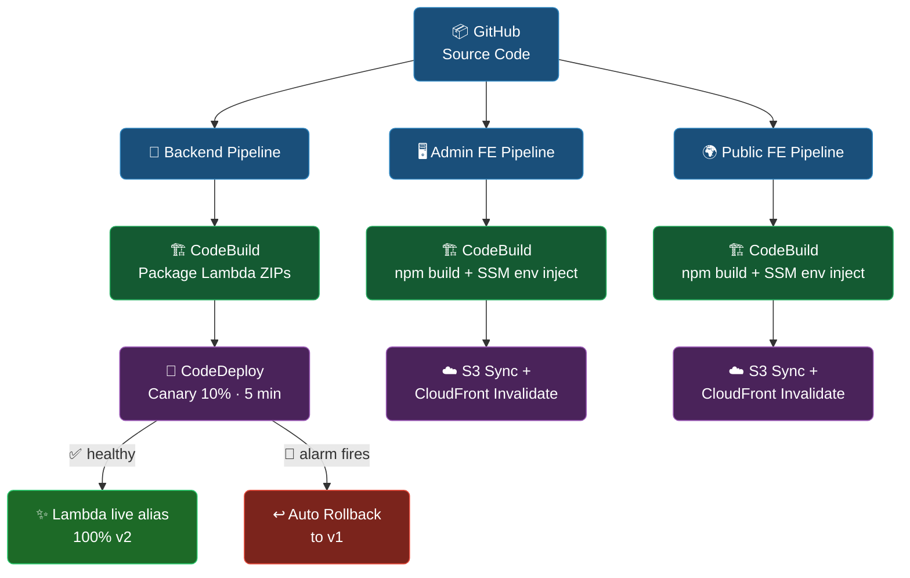
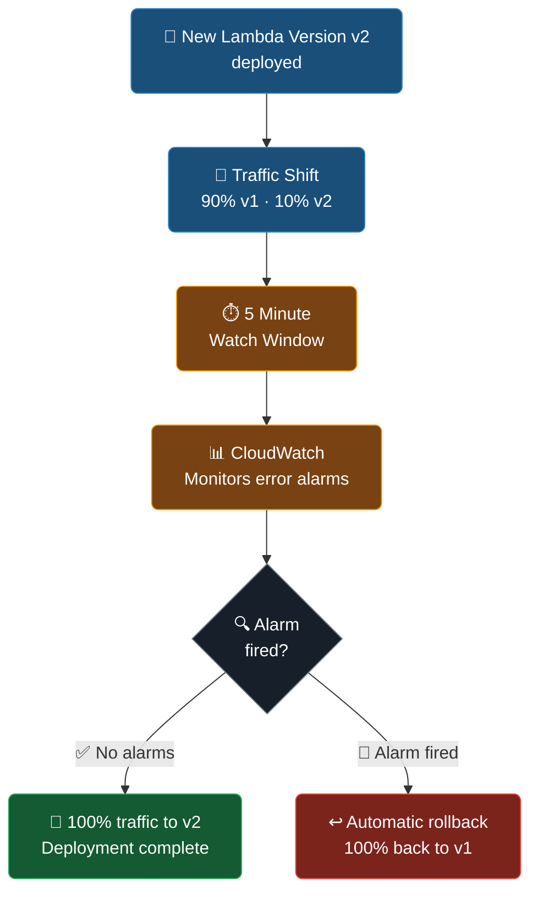
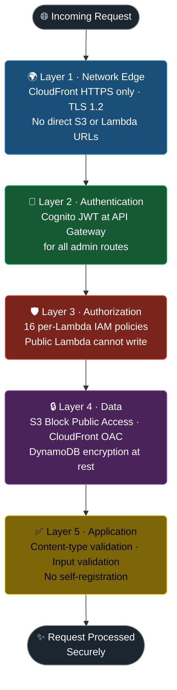

<div align="center">

# ☁️ AWS Serverless Blog Platform (www.sblog.stsproj.com)

### A production-style, fully serverless blog platform built entirely on AWS

[](https://aws.amazon.com)
[](https://www.terraform.io)
[](https://aws.amazon.com/lambda)
[](https://aws.amazon.com/dynamodb)
[](https://github.com)

> **Two frontends. Two APIs. Strict security boundaries. Event-driven by default. 100% Infrastructure as Code.**

</div>

---

## Table of Contents

- [Project Overview](#-project-overview)
- [Architecture Overview](#️-architecture-overview)
- [AWS Services Used](#-aws-services-used)
- [Lambda Functions](#-lambda-functions)
- [API Design — API Gateway](#-api-design--api-gateway)
- [Database Design — DynamoDB](#️-database-design--dynamodb)
- [Authentication — Amazon Cognito](#-authentication--amazon-cognito)
- [Event-Driven Architecture — EventBridge](#-event-driven-architecture--eventbridge)
- [Secure Media Handling — Presigned URLs](#-secure-media-handling--presigned-urls)
- [CI/CD Pipeline](#-cicd-pipeline)
- [Observability & Monitoring](#-observability--monitoring)
- [Security Design](#-security-design)
- [Infrastructure as Code — Terraform](#️-infrastructure-as-code--terraform)
- [Frontend Applications](#-frontend-applications)
- [Project Structure](#-project-structure)
- [Key Skills Demonstrated](#-key-skills-demonstrated)
- [Author](#-author)

---

## 🎯 Project Overview

This is a **production-style serverless blog platform** built end-to-end on AWS — from compute and storage to CI/CD and observability. The goal was to design a real-world cloud system that solves the common pitfalls of hobby AWS projects: mixed authentication levels, publicly accessible storage buckets, synchronous blocking for async work, and manually configured resources.

### What makes this different from typical demo projects

| Common Demo Project Problem | How this project solves it |
|---|---|
| Admin and public APIs share the same Gateway | Two completely separate API Gateways with different trust levels |
| S3 buckets are publicly accessible | All buckets private — media served exclusively via CloudFront OAC |
| Security is bolted on | Cognito authorizer is enforced at the API Gateway layer, not in Lambda code |
| Async work (emails, cleanup) blocks user responses | Fully decoupled via EventBridge — users get instant responses |
| Single IAM role shared by all functions | 16 granular per-function IAM policies (least privilege by design) |
| Infrastructure manually created in the Console | 100% Terraform — every resource is codified and version-controlled |
| No observability | X-Ray tracing, CloudWatch alarms, structured logging, and a unified dashboard |
| Deployments are risky | Canary deployments via CodeDeploy with automatic rollback on alarm |

---

## 🏛️ Architecture Overview

The platform is split into three clearly separated zones. Failure in one zone does not cascade to the others.



### Architecture Diagram


### AWS X-Ray Trace Map


---

## ☁️ AWS Services Used

| Service | Role in this Project |
|---|---|
| **AWS Lambda** | All backend compute — 6 single-purpose functions + 1 shared layer |
| **Amazon API Gateway** | REST API layer — 2 separate gateways (public and admin) with throttling |
| **Amazon DynamoDB** | Primary database — 2 tables, on-demand billing, GSIs for efficient querying |
| **Amazon S3** | 3 private buckets: public frontend, admin frontend, and media storage |
| **Amazon CloudFront** | 2 CDN distributions — path-based routing, TLS termination, OAC to S3 |
| **Amazon Cognito** | Admin authentication — User Pool as a native API Gateway authorizer |
| **Amazon EventBridge** | Custom event bus — async decoupling of API writes from side effects |
| **Amazon SES** | Transactional email — sends lead notification emails to admin |
| **Amazon SQS** | 3 Dead Letter Queues — captures and alerts on failed async operations |
| **AWS CodePipeline** | 3 separate CI/CD pipelines (backend, admin frontend, public frontend) |
| **AWS CodeBuild** | Builds Lambda packages and Vite SPAs, reads config from SSM |
| **AWS CodeDeploy** | Canary Lambda deployments — 10% traffic for 5 min, auto-rollback |
| **AWS X-Ray** | Distributed tracing across Lambda, API Gateway, and DynamoDB |
| **Amazon CloudWatch** | Structured logs, custom alarms, and a unified observability dashboard |
| **AWS IAM** | 16 custom per-function least-privilege policies |
| **AWS KMS** | Encryption of CodePipeline build artifacts |
| **AWS SSM Parameter Store** | Build-time and runtime configuration injection |
| **Amazon SNS** | Alarm notification topic — emails on CloudWatch alarm triggers |
| **Amazon Route 53** | DNS routing to CloudFront distributions |

---

## ⚡ Lambda Functions

Six single-purpose Lambda functions — each with its own IAM role, log group, and alarm set. No god functions.

| Function | Trigger | Responsibility | Services Accessed |
|---|---|---|---|
| `admin_blog_posts` | API Gateway (Admin) | Full CRUD + lifecycle (publish, archive, delete) on posts | DynamoDB (R/W), EventBridge |
| `public_posts_lambda` | API Gateway (Public) | Read-only access to published posts | DynamoDB (Query via GSI) |
| `leads_lambda` | API Gateway (Both) | Create leads (public) · Read leads (admin) | DynamoDB (R/W), EventBridge |
| `presign_lambda` | API Gateway (Admin) | Generate time-limited S3 upload URLs | S3 (PutObject only) |
| `notifications_lambda` | EventBridge | Send lead notification email | SES |
| `cleanup_lambda` | EventBridge | Delete S3 media when a post is deleted | S3 (DeleteObject only) |

**Shared Lambda Layer:** All functions use a common layer containing the AWS SDK and X-Ray SDK, reducing deployment package sizes and keeping dependencies consistent.

```
Runtime:     Node.js 18.x
Tracing:     AWS X-Ray (active mode)
Log retention: 7 days per function
Aliases:     live (production traffic) · beta (canary target)
```

**Blast radius design:** If the Notifications Lambda fails, it has zero impact on the blog API or admin CMS. Each function fails independently.

---

## 🌐 API Design — API Gateway

Two completely separate REST APIs serve two completely different audiences.

```
  PUBLIC API GATEWAY                    ADMIN API GATEWAY
  ─────────────────                     ─────────────────
  No authentication                     Cognito User Pool Authorizer
  GET  /posts                           GET    /admin/posts
  GET  /posts/{postId}                  POST   /admin/posts
  POST /leads                           PUT    /admin/posts/{id}
                                        DELETE /admin/posts/{id}
                                        POST   /admin/posts/{id}/publish
                                        POST   /admin/posts/{id}/unpublish
                                        POST   /admin/posts/{id}/archive
                                        POST   /admin/media/upload_url
                                        GET    /admin/leads
```

**CloudFront as the single entry point:**
All traffic enters through CloudFront distributions. A CloudFront Function rewrites path prefixes (`/api/*` → `/*`) before forwarding to API Gateway, so both frontends use the same domain for API and static assets — eliminating CORS entirely.

---

## 🗄️ Database Design — DynamoDB

**Posts Table**

| Attribute | Type | Role |
|---|---|---|
| `postId` | String (PK) | Primary key |
| `status` | String | `DRAFT` / `PUBLISHED` / `ARCHIVED` |
| `publishedAt` | String | ISO timestamp used for sort |
| `authorId` | String | Author reference |
| `title`, `content`, `tags` | Various | Post content fields |

**Global Secondary Indexes:**

| GSI Name | Partition Key | Sort Key | Query Use Case |
|---|---|---|---|
| `publishedAtIndex` | `status` | `publishedAt` | Public blog — list all published posts in date order |
| `authorIDIndex` | `authorId` | `createdAt` | Admin view — list posts by author |

**CQRS (Lite) Approach:**
The public Lambda only has `Query` permission on the GSI. The admin Lambda has full CRUD. The same table serves both read and write paths — but IAM enforces the segregation so the public function **physically cannot write to the table**.

**Leads Table**

Stores lead submissions from the public blog. Admin Lambda can read all leads. Only leads Lambda can write.

---

## 🔐 Authentication — Amazon Cognito

Amazon Cognito User Pool provides JWT-based authentication for the admin CMS.



**Key design decisions:**
- **Admin-create-only** — no self-registration. Users must be provisioned by an admin.
- **Authorization at the infrastructure layer** — Cognito is enforced at API Gateway, not in Lambda code. Lambda never receives an unauthenticated request.
- **Public API has zero Cognito dependency** — public users are never impacted by auth service issues.

---

## 📡 Event-Driven Architecture — EventBridge

A custom EventBridge bus decouples API handlers from their side effects.



**Why this matters for the user:** The user gets an instant API response. The email notification or media cleanup happens behind the scenes without adding to their response time.

**Resilience:** Each EventBridge rule targets the Lambda with a retry policy (up to 10 retries). Failed events after exhausting retries are sent to an SQS Dead Letter Queue, which triggers a CloudWatch alarm.

---

## 📎 Secure Media Handling — Presigned URLs

File uploads bypass Lambda entirely using the **Valet Key pattern**.



**Security note:** The S3 media bucket has no public access. The presign Lambda validates allowed content-types before generating the URL — preventing malicious file types from being hosted.

---

## 🚀 CI/CD Pipeline

Three separate CodePipeline pipelines ensure that a change to the public frontend never triggers a backend deployment.



### Canary Deployment (Lambda)

CodeDeploy shifts 10% of Lambda traffic to the new version for 5 minutes before completing the rollout. If a CloudWatch alarm fires during that window, traffic is automatically rolled back to the previous version — no manual intervention needed.



### Build-time Config Injection

CodeBuild reads environment config from SSM Parameter Store and injects Terraform-generated values (API URLs, Cognito IDs, CloudFront domains) as Vite environment variables at build time — no hardcoded values, no manual copy-pasting between services.

---

## 🔭 Observability & Monitoring

The three pillars of observability are all implemented.

### 1 — Distributed Tracing: AWS X-Ray

Every Lambda function and API Gateway stage is instrumented with X-Ray. A single user request produces a trace spanning CloudFront → API Gateway → Lambda → DynamoDB, with subsegments for each service call.


### 2 — Structured Logging: CloudWatch Logs

All Lambda functions emit structured JSON logs with a `correlationId`, so a single request can be traced across multiple log groups.

### 3 — Metrics & Alarms: CloudWatch

| Alarm | Metric | Threshold | Action |
|---|---|---|---|
| Lambda error rate | `Errors` per function | > 1 per 5 min | SNS → email |
| API Gateway 5xx errors | `5XXError` | > 1 per 5 min | SNS → email |
| DLQ message count | `ApproximateNumberOfMessages` | > 0 | SNS → email |
| DynamoDB throttles | `ThrottledRequests` | > 1 | SNS → email |
| CloudFront 5xx rate | `5xxErrorRate` | > 5% | SNS → email |

A **unified CloudWatch Dashboard** provides a single-pane-of-glass view across all Lambda functions, API Gateways, DynamoDB tables, and queues.

---

## 🛡️ Security Design

Security is layered across every tier — not bolted on after the fact.

### IAM Least Privilege — Permission Matrix

Each Lambda function has exactly the permissions it needs. Nothing more.

|  | DynamoDB Posts | DynamoDB Leads | S3 Write | S3 Delete | EventBridge | SES |
|---|:---:|:---:|:---:|:---:|:---:|:---:|
| `admin_blog_posts` | ✅ CRUD | | | | ✅ Publish | |
| `public_posts_lambda` | ✅ Query only | | | | | |
| `leads_lambda` | | ✅ CRUD | | | ✅ Publish | |
| `presign_lambda` | | | ✅ PutObject | | | |
| `notifications_lambda` | | | | | | ✅ SendEmail |
| `cleanup_lambda` | | | | ✅ DeleteObject | | |

**16 custom IAM policies** — each scoped to a specific resource ARN. No wildcards. No shared roles.

### Defence in Depth



---

## 🏗️ Infrastructure as Code — Terraform

The **entire platform** is defined in Terraform. Zero manual console configuration.

| Terraform File | AWS Resources Created |
|---|---|
| `lambda.tf` | 6 Lambda functions, 1 shared layer, aliases, log groups |
| `api_gateway.tf` | 2 API Gateways, stages, methods, Cognito authorizer |
| `database.tf` | 2 DynamoDB tables with GSIs, encryption, contributor insights |
| `s3_buckets.tf` | 3 S3 buckets with lifecycle rules, versioning, CORS, policies |
| `cloudfront.tf` | 2 CloudFront distributions, OAC, custom cache behaviours |
| `auth.tf` | Cognito User Pool and App Client |
| `eventbridge.tf` | Custom event bus, rules, targets, retry policies, DLQ targets |
| `lambda.tf` | SQS Dead Letter Queues |
| `ci_cd_*.tf` | 3 CodePipeline pipelines, CodeBuild projects, CodeDeploy groups |
| `cloudwatch_dashboard.tf` | Dashboard, alarms, SNS topic |
| `iam/` | 16 custom IAM policies with resource-level scoping |
| `ssm.tf` | 8 SSM parameters for build-time config injection |
| `ses.tf` | SES verified email identity |
| `route53.tf` | DNS records pointing to CloudFront |

```
Terraform version:  ~> 1.14
AWS Provider:       ~> 5.0
Region:             eu-west-1 (Ireland)
Resource prefix:    sblg-  (e.g. sblg-posts, sblg-media-bucket)
```

---

## 💻 Frontend Applications

### Admin CMS (React + TypeScript + Vite)

A full-featured content management system for managing posts, media, and leads.

| Library | Purpose |
|---|---|
| React 19 + TypeScript | UI framework with type safety |
| TanStack Query v5 | Server state management and caching |
| React Hook Form + Zod | Form handling with schema validation |
| AWS Amplify v6 | Cognito authentication integration |
| TipTap v3 | Rich text editor for post content |
| Tailwind CSS v4 + Radix UI | Accessible, utility-first UI |
| Zustand | Lightweight client state management |

### Public Blog (React + TypeScript + Vite)

An intentionally lightweight, read-only blog viewer.

| Library | Purpose |
|---|---|
| React 19 + TypeScript | UI framework |
| TanStack Query v5 | API data fetching with caching |
| Axios | HTTP client |

**Design decision:** The public frontend has no auth library, no rich text editor, no form framework — it only reads and displays content. Keeping it lean reduces bundle size and attack surface.

---

## 📁 Project Structure

```
AWS_SERVERLESS_BLOG/
│
├── backend/                        # Lambda function source code (Node.js)
│   ├── admin_blog_post/            # Posts CRUD + lifecycle operations
│   ├── public_posts_lambda/        # Read-only published post access
│   ├── leads_lambda/               # Lead creation + admin reads
│   ├── presign_lambda/             # S3 presigned URL generation
│   ├── notifications_lambda/       # SES email on new lead
│   ├── cleanup_lambda/             # S3 media cleanup on post deletion
│   └── blog_lambda_layer/          # Shared Layer (AWS SDK + X-Ray SDK)
│
├── infrastructure/                 # All AWS infrastructure as Terraform
│   ├── main.tf                     # Provider config
│   ├── lambda.tf                   # Lambda functions + aliases + layers
│   ├── api_gateway.tf              # REST APIs + Cognito authorizer
│   ├── database.tf                 # DynamoDB tables + GSIs
│   ├── s3_buckets.tf               # S3 buckets + bucket policies
│   ├── cloudfront.tf               # CDN distributions
│   ├── auth.tf                     # Cognito User Pool
│   ├── eventbridge.tf              # Event bus + rules + DLQs
│   ├── ci_cd_*.tf                  # 3 CI/CD pipelines
│   ├── cloudwatch_dashboard.tf     # Dashboard + alarms
│   ├── ssm.tf                      # Parameter Store entries
│   └── iam/policies/               # 16 granular IAM policy documents
│
├── admin-frontend/                 # React + Vite admin CMS (TypeScript)
│   └── src/
│       ├── api/                    # Axios API client functions
│       ├── components/             # Reusable UI components
│       ├── pages/                  # Route-level page components
│       ├── hooks/                  # Custom React hooks
│       └── store/                  # Zustand auth store
│
├── public-frontend/                # React + Vite public blog (TypeScript)
│   └── src/
│       ├── api/                    # Public API client functions
│       ├── components/             # Blog UI components
│       └── pages/                  # Route-level page components
│
├── buildspec.backend.yml           # CodeBuild spec — Lambda packaging + deploy
├── buildspec.admin-frontend.yml    # CodeBuild spec — Admin SPA build + S3 sync
└── buildspec.public-frontend.yml   # CodeBuild spec — Public SPA build + S3 sync
```

---

## 🎓 Key Skills Demonstrated

This project was built to showcase practical, production-relevant AWS skills. Here's what each section of the system demonstrates:

| Skill Area | Demonstrated By |
|---|---|
| **Serverless architecture** | 6 Lambda functions, API Gateway, DynamoDB — zero servers to manage |
| **AWS security best practices** | 16 least-privilege IAM policies, Cognito auth, private S3 + CloudFront OAC |
| **Event-driven design** | EventBridge custom bus, pub/sub pattern, decoupled async workflows |
| **Infrastructure as Code** | 100% Terraform — no manual console changes, all resources version-controlled |
| **CI/CD on AWS** | 3 CodePipeline pipelines with CodeBuild, CodeDeploy canary deployments |
| **Observability** | X-Ray distributed tracing, structured CloudWatch logging, custom alarms |
| **DynamoDB data modelling** | GSI design for efficient read patterns, CQRS-lite via IAM separation |
| **Resilience patterns** | SQS Dead Letter Queues, retry policies, canary rollback, bulkhead isolation |
| **CDN & static hosting** | CloudFront with path-based routing, S3 SPA hosting, TLS termination |
| **Secure file handling** | Presigned URLs (Valet Key pattern), content-type validation |
| **Configuration management** | SSM Parameter Store for build-time config injection via CodeBuild |
| **Cost optimisation** | On-demand DynamoDB, S3 lifecycle rules, CloudFront caching, short log retention |

---

## 👤 Author

**Shaun**
AWS Cloud Engineer

---

<div align="center">

*Every resource, every IAM policy, every alarm — all defined in the `infrastructure/` directory. No ClickOps.*

</div>
